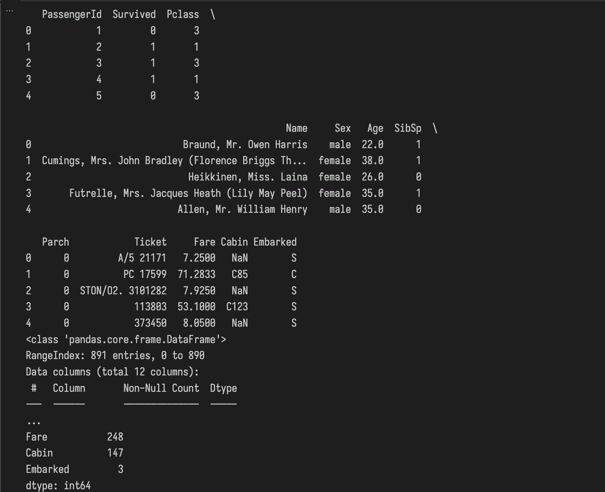
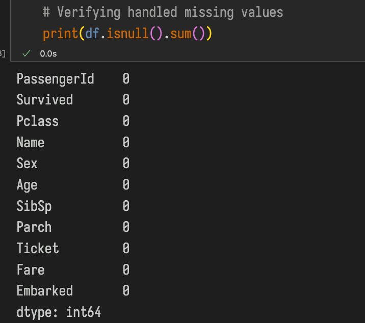
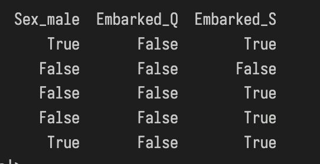
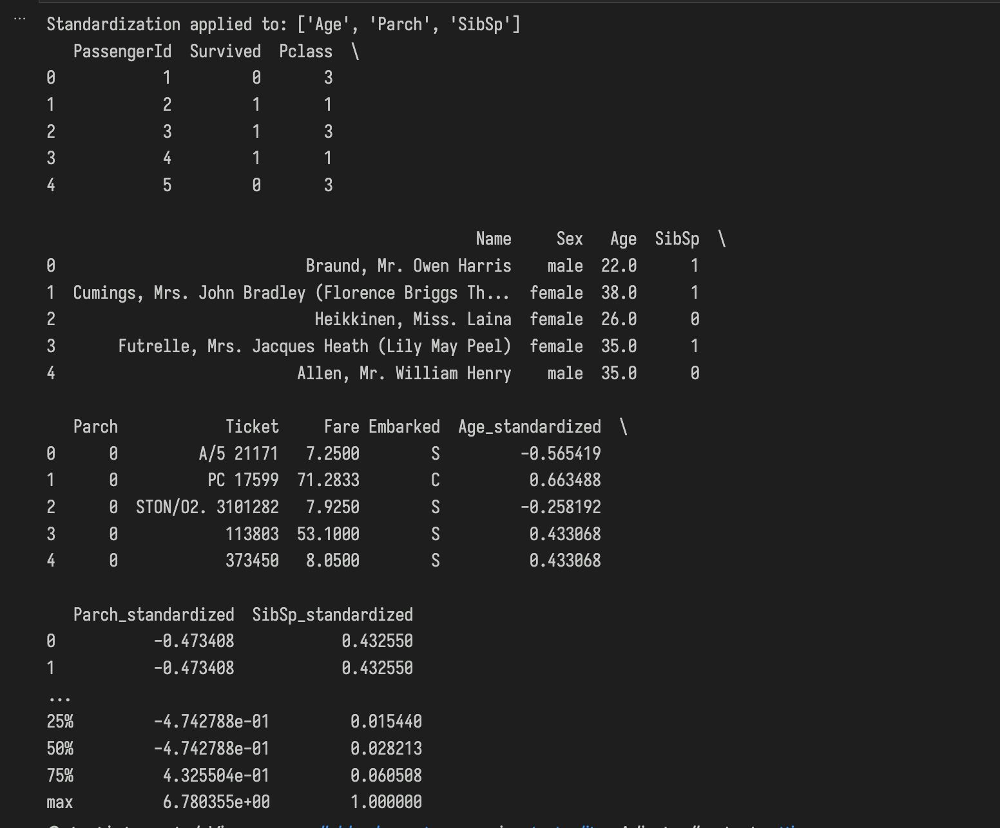
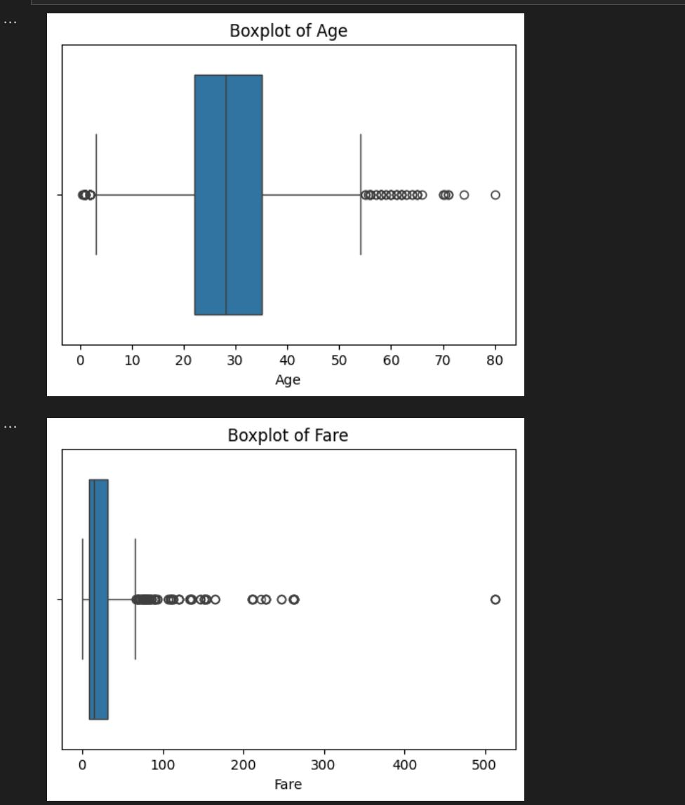
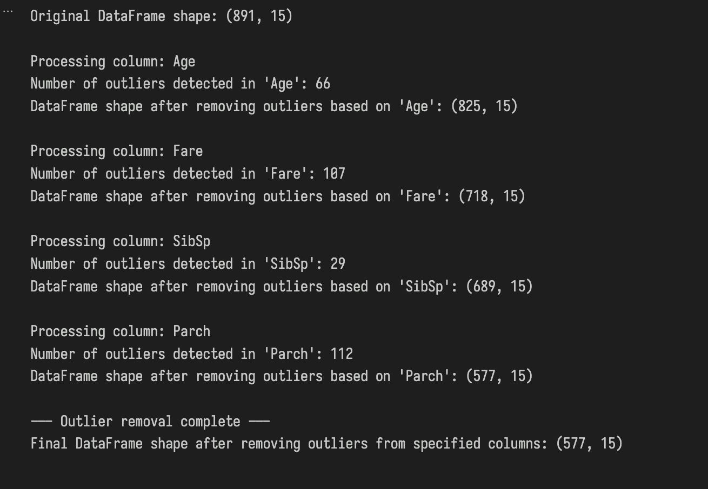

# AI & ML Internship - Task 1: Data Cleaning & Preprocessing

This repository contains the work for the first task of the AI & ML Internship, focusing on essential data cleaning and preprocessing techniques.

**Objective:** To clean and prepare raw data from the Titanic dataset for data analysis.

**Learning Journey:**

This task provided a great opportunity to solidify fundamental skills beyond just data science techniques. A key part of the process involved learning how to set up an isolated Python environment using `venv` to manage project dependencies without conflicts. We then used `pip` to install the necessary libraries like pandas, numpy, and matplotlib within this environment.

Furthermore, mastering Git for version control was crucial. This included understanding how to initialize a repository, stage and commit changes, and connect to a remote GitHub repository. Encountering and resolving issues like "non-fast-forward" and "refusing to merge unrelated histories" through `git pull` and the `--allow-unrelated-histories` flag was a valuable learning experience. Properly using a `.gitignore` file was also essential to prevent unnecessary files (like the virtual environment itself) from being tracked.

**Repository Contents:**

* `data_cleaning.ipynb`: The Jupyter Notebook containing all the Python code for data exploration, cleaning, and preprocessing.
* `Titanic-Dataset.csv`: The raw dataset used for this task.
* `requirements.txt`: A file listing the necessary Python libraries to run the notebook.
* `README.md`: This file, explaining the project.
* `images/`: A directory containing screenshots or visualizations from the notebook.

**Task Steps Performed:**

1.  **Data Loading and Initial Exploration:** Loaded the dataset and performed initial checks for data types, missing values, and summary statistics.

    

2.  **Handling Missing Values:** Addressed missing data in columns like 'Age' (imputation with median) and 'Embarked' (imputation with mode), and handled columns with excessive missing data like 'Cabin'. For instance, missing 'Age' values were filled using its median:

    ```python
    df['Age'].fillna(median_age, inplace=True)
    ```

    

3.  **Encoding Categorical Features:** Converted categorical columns ('Sex', 'Embarked') into a numerical format using One-Hot Encoding to make them suitable for machine learning algorithms.

    

4.  **Handling Outliers:** Visualized outliers in numerical features using boxplots and applied the Interquartile Range (IQR) method to remove rows with extreme values from relevant columns.

    

    

5.  **Feature Scaling:** Applied standardization and/or normalization techniques to scale numerical features, bringing them to a similar range for better model performance.

    

**How to Run the Code:**

1.  Clone this repository to your local machine.
2.  Navigate to the repository directory in your terminal.
3.  It's highly recommended to set up a virtual environment:
    ```bash
    python3 -m venv venv
    source venv/bin/activate # On Windows use `venv\Scripts\activate`
    ```
4.  Install the required libraries using the `requirements.txt` file:
    ```bash
    pip install -r requirements.txt
    ```
5.  Launch Jupyter Notebook or Jupyter Lab from the activated environment:
    ```bash
    jupyter notebook
    # or
    jupyter lab
    ```
6.  Open the `data_cleaning.ipynb` notebook and run the cells.

This README provides an overview of the preprocessing steps taken in the notebook.
